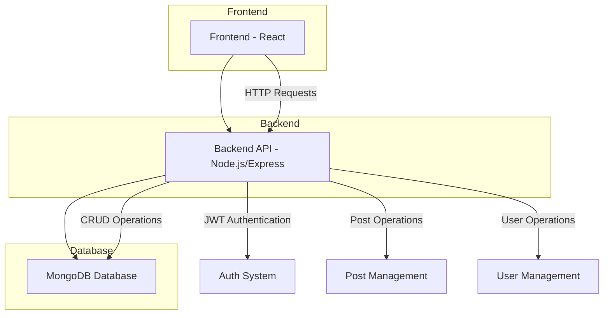

# Application Architecture

```mermaid
graph TD
    A[Frontend - React] --> B[Backend API - Node.js/Express]
    B --> C[MongoDB Database]
    
    A -->|HTTP Requests| B
    B -->|CRUD Operations| C
    
    subgraph Frontend
        A
    end
    
    subgraph Backend
        B
    end
    
    subgraph Database
        C
    end
    
    B -->|JWT Authentication| D[Auth System]
    B -->|Post Operations| E[Post Management]
    B -->|User Operations| F[User Management]
```